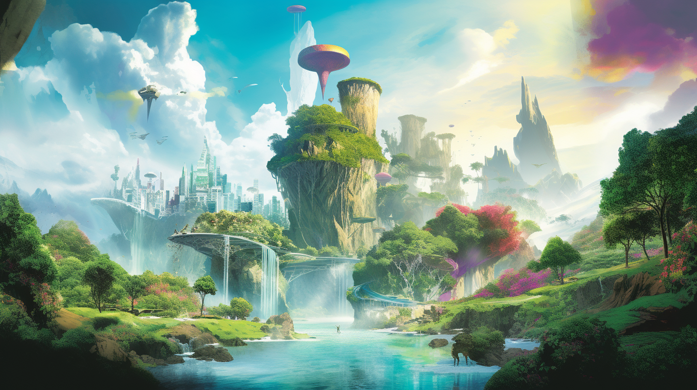
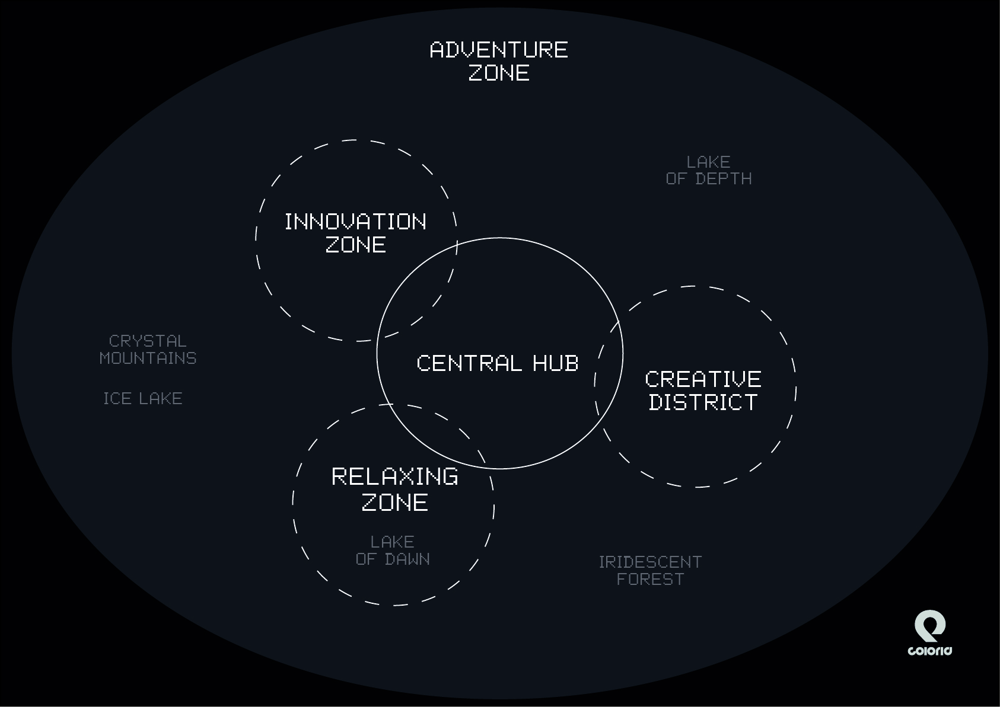

# Metaverse

<figure><figcaption></figcaption></figure>

Welcome to the futuristic world of COLORIA, a territory of creative exploration with infinite possibilities. The landscape is a breathtaking fusion of organic and technological elements, with imposing skyscrapers and sprawling gardens intertwined. The natural world is like you've never seen before, with iridescent forests, sparkling rivers, and colorful flora and fauna.

<figure><figcaption></figcaption></figure>

There are different zones to explore, each with its unique features and attractions. In the central hub, you'll find the main portal that connects you to other realms within COLORIA. The art district is a bustling hub of creativity, with studios and galleries showcasing the works of talented artists from across the metaverse. The innovation zone is where the latest technological advancements are on display, with cutting-edge gadgets and devices that will amaze you.

Venturing further, you'll come across the adventure zone, where you can embark on thrilling quests and missions that will test your skills and courage. The relaxation zone is the perfect place to recharge, with serene gardens, meditation areas, and soothing waterfalls.

Throughout COLORIA, you'll encounter friendly inhabitants, both organic and artificial, who will guide you on your journey and inspire you to reach new heights of creativity and imagination. Whether you're a seasoned member of the T-Squad or a newcomer to the metaverse, COLORIA is a world that will capture your heart and imagination.
