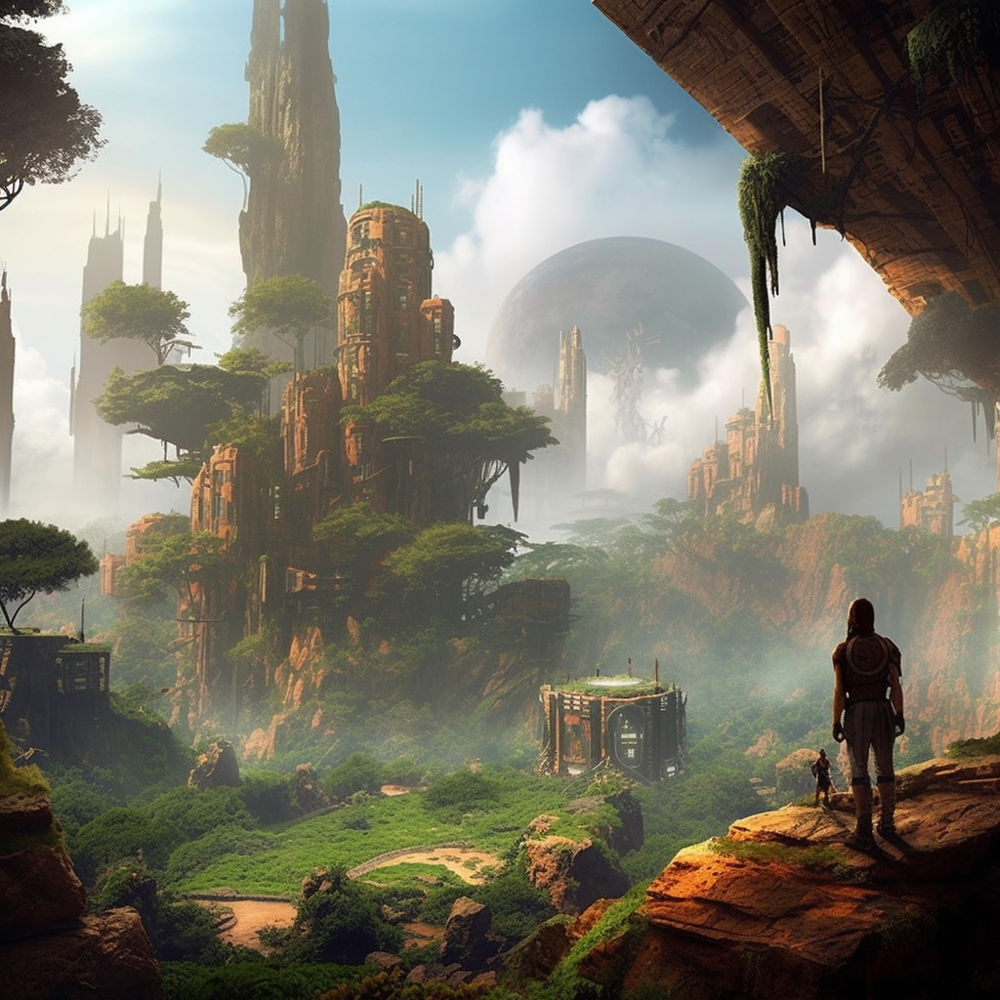

# Adventure Zone

<figure><figcaption></figcaption></figure>

Colorians will be able to immerse themselves in epic solo or group adventures, where they will have to face fantastic creatures and discover hidden treasures in mystical dungeons, hills, or troglodyte canyons. They can also challenge other Colorians or their companions in "magical" combat arenas to win even more valuable rewards or Bonus Points.

In addition to the thrilling action, quests will allow Colorians to learn useful skills for other activities in the metaverse. For example, they will be able to learn how to grow mystical plants and vegetables, craft tools and magical potions, or even tame fantastic creatures to become their companions. The possibilities for learning and skill development are endless in the world of COLORIA.
