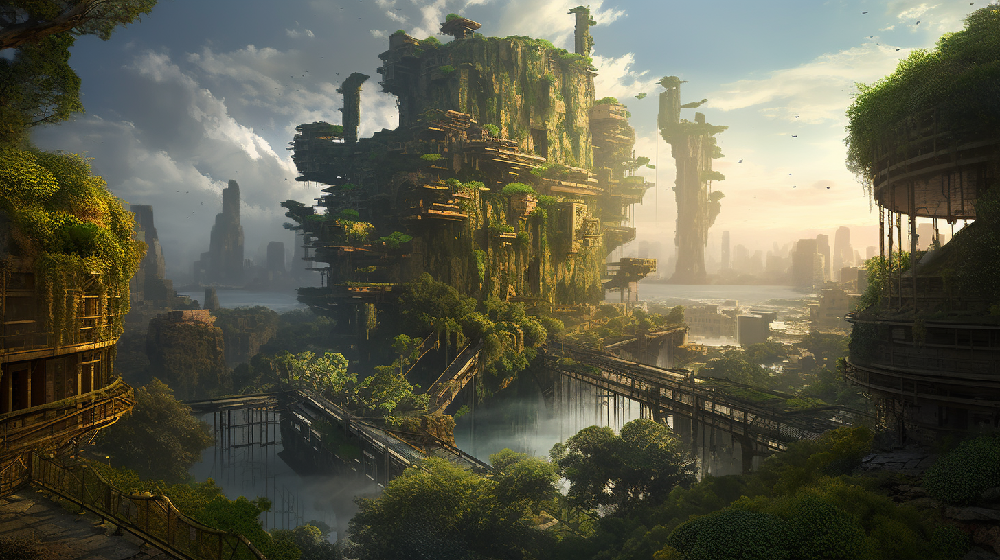

# Creative District

<figure><figcaption></figcaption></figure>

The Creative District is the perfect place for artists and creatives who wish to display their work to the Colorians. This area is divided into two parts: the Exhibition and the Workshop.

In the Workshop section, everyone can participate, learn, and share their knowledge in areas such as drawing, painting, music, film production, sculpture, 3D modeling, photography, video, writing, theater, digital art, culinary art, architecture, and much more. As for the Exhibition part, it allows the most talented to showcase their creations to the Colorians. This art gallery is divided into different thematic rooms where artists can exhibit their works. This part of the Creative District will also be the primary market where artists can directly sell their works to customers, with a percentage for the Coloria DAO, while the Coloria NFT Marketplace will focus on the secondary market.

This design ensures a vibrant and dynamic ecosystem that encourages creative expression and collaboration, while also providing artists with a platform to gain recognition and earn income from their work. With the integration of blockchain technology, artists can also benefit from enhanced ownership rights and secure, transparent transactions.
