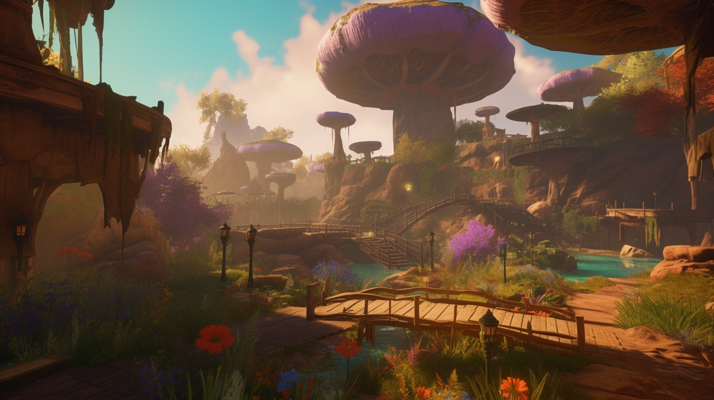

# Relaxing Zone

<figure><figcaption></figcaption></figure>

The Relaxation Zone in COLORIA is much more than just a place to unwind and rest. It is a space to explore one's inner self, connect with oneself, and discover new ways to grow personally. The serene gardens, soothing waterfalls, and meditation spaces are perfect for contemplation and reflection, while the yoga rooms are the ideal place to relax the body and mind. However, the Relaxation Zone doesn't limit itself to just yoga and meditation.

Conferences and workshops on personal development, psychology, and spirituality are also offered to help players discover themselves and grow on a personal level. This zone is a true sanctuary for those seeking to connect with their soul and inner being, all while exploring the boundaries of their imagination and creativity.
