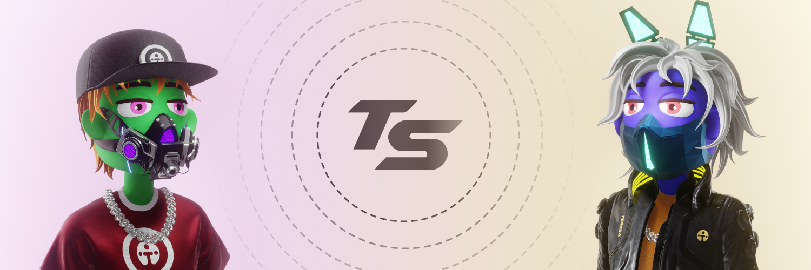

# Colorians

<figure><figcaption></figcaption></figure>

In COLORIA, we view our users as creators, as we believe that everyone has a creative potential that deserves to be explored and developed. That's why we've created the T-Squad NFT collection, which represents each creator's unique avatars in the metaverse. The T-Squads are 3D characters, each possessing unique rarity among the 20,000 available. They are designed to allow each creator to represent themselves uniquely and personally within COLORIA. Whether you're an artist, a scientist, a gamer, or simply a dreamer, your T-Squad will be the avatar accompanying you on all your adventures within COLORIA.

Each T-Squad is unique, with its own features like specific clothing and accessories, as well as special abilities in the world of COLORIA. Community members can collect different T-Squads based on their rarity, appearance, and abilities, and utilize these characters in their experience in COLORIA. The T-Squad collection plays a significant part in COLORIA's economy, as it allows community members to actively involve themselves in the metaverse universe, participate in events, and receive special rewards.

**Explore the collection here:** [https://secret-stash.io/collection/266](https://secret-stash.io/collection/266)
