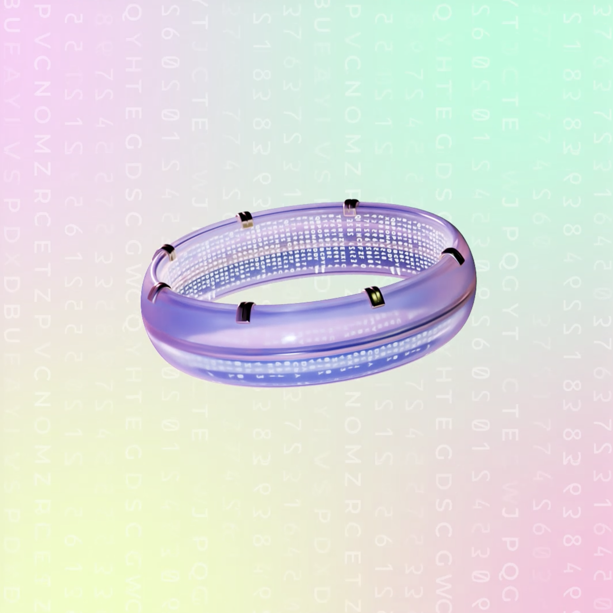

# Ring

"Coloria Ring" is a collection of exclusive NFTs that provide access to the COLORIA metaverse. Each T-Ring is unique and offers its owner unique benefits and privileges within the virtual world. T-Rings are a way to ensure a certain rarity in the digital universe and reward the most active and involved members of the community.

<figure><figcaption></figcaption></figure>

Colorians who own a T-Ring have priority access to all areas of COLORIA, as well as exclusive events and special rewards. As T-Ring owners, Colorians are part of an elite community of creatives, pioneers, and innovators who contribute to making COLORIA an exceptional place where imagination and creativity are celebrated.

**To get a T-Ring, click here:**



## Distribution

At COLORIA, we like to innovate and have thus created a new way to distribute COLORIA's "Ring".&#x20;

By offering increasing benefits to holders who join the project early, this approach will stimulate investor engagement from the beginning.

The distribution of 4000 Rings per level, with increasing prices and decreasing benefits, will enhance our ability to reward and retain those who believe in our project, thereby creating a real advantage for them.

| Level | Quantity | Price (CAPS) | Life Discount |
| ----- | -------- | ------------ | ------------- |
| 0     | 24       | 0            | 100%          |
| 1     | 50       | 50           | 95%           |
| 2     | 100      | 100          | 90%           |
| 3     | 158      | 200          | 85%           |
| 4     | 166      | 400          | 80%           |
| 5     | 178      | 600          | 75%           |
| 6     | 821      | 800          | 70%           |
| 7     | 189      | 1000         | 65%           |
| 8     | 190      | 1250         | 60%           |
| 9     | 197      | 1500         | 55%           |
| 10    | 200      | 1800         | 50%           |
| 11    | 228      | 2100         | 45%           |
| 12    | 243      | 2400         | 40%           |
| 13    | 246      | 2700         | 35%           |
| 14    | 254      | 3000         | 30%           |
| 15    | 280      | 3300         | 25%           |
| 16    | 291      | 3600         | 20%           |
| 17    | 309      | 3900         | 15%           |
| 18    | 311      | 4200         | 10%           |
| 19    | 313      | 4500         | 5%            |
| 20    | 325      | 5000         | 2,5%          |
