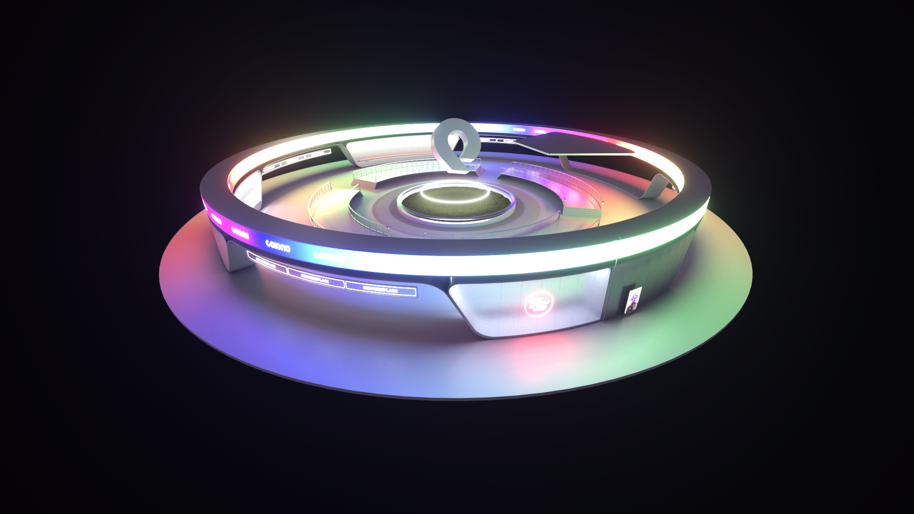

# Central Hub

<figure><figcaption></figcaption></figure>

Le Central Hub de COLORIA est un lieu époustouflant, rempli d'une végétation luxuriante, d'arbres majestueux, de buissons et de ruisseaux sinueux qui serpentent à travers les rues. Les gratte-ciels se dressent fièrement au milieu de cette jungle urbaine, entièrement recouverts de verdure qui les rend presque invisibles. Cet endroit magique est **la porte d'entrée** dans le monde de COLORIA, où les Colorians sont accueillis chaleureusement par la gardienne de la cité.
